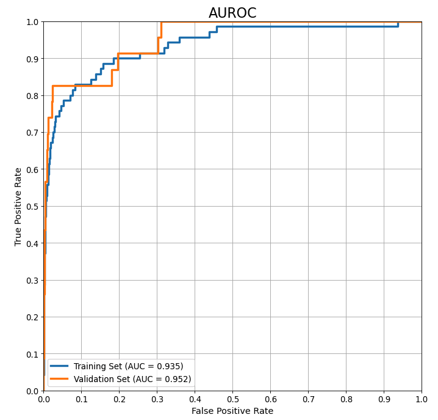
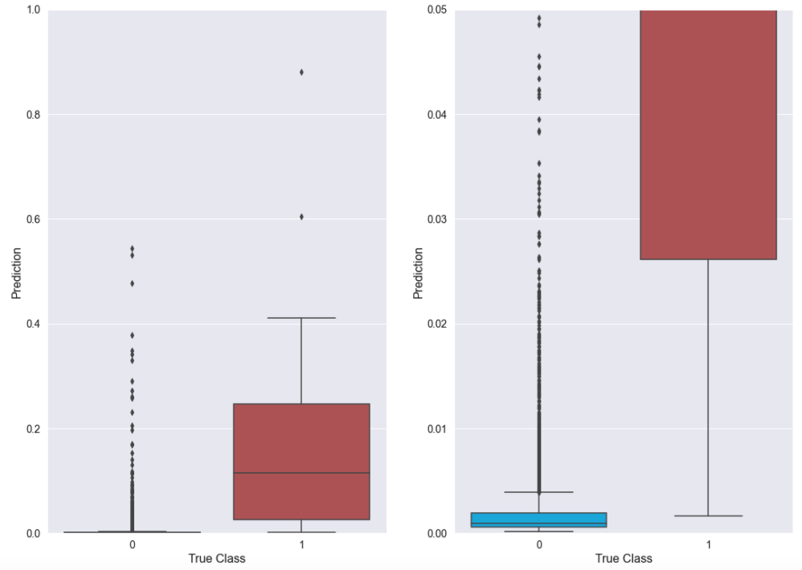

# Minimum Viable Product

#### BUILDING A PREDICTIVE MODEL TO HELP PROSPECTIVE PATIENTS ESTIMATE THE RELATIVE LIKELIHOOD OF MORTALITY SHOULD THEY CHOOSE TO PROCEED WITH AN ELECTIVE SURGERY

Using raw data consisting of 32,001 general elective surgery patient encounters at the Cleveland Clinic spanning a 5-year and 9-month period, a logistic regression model has been developed to predict the likelihood of the relatively rare outcome of mortality in the 30 days following an elective surgery. The modeling objective is to maximize Recall (meaning minimizing Type II errors or False Negatives at the expense of being willing to accept Type I errors or False Positives). The priority here lies with not missing a case where the patient has a relatively high chance of mortality (i.e., mislabeling it as a low chance).

Note that the model provides values between 0.0 and 1.0, with a larger number reflecting a higher likelihood of a mortality outcome. However, these values are uncalibrated, so they do not represent probabilities, just relative likelihoods of mortality. 

The Area Under the Receiver Operating Curve (AUROC) plot shown below indicates the predictive performance observed with the latest model developed (comparing held-out Validation set data to Traning set data; Test set data has not yet been touched and will not be until final model selection):

As can be seen above, the model developed on the Training set generalizes well to the Validation set and delivers a high True Positive Rate (Recall) of approximately 83% with a low False Positive Rate (less than 5%).  Moreover, allowing a False Positive Rate of just over 30% leads to a True Positive Rate (on the Validation set ) of 100%.

The visualization below (based on the Validation set) shows how well the current model separates the two post-surgical mortality outcomes (1 = Mortality, 0 = No Mortality). Note that the boxplot on the right is simply a zoomed-in version of the plot on the left: 

As seen in either boxplot above, the model gives noticeably larger mortality predictions for Validation set cases that really did result in mortality than it does for the vast majority of cases where mortality did not occur. Setting a threshold of roughly 0.002 to 0.004 would result in essentially perfect predictive separation between the two outcomes (at the expense of some obvious False Positives). However, of the 5635 negative (non-mortality) outcomes in the Validation set, over 4900 of them would still be correctly classified as True Negatives. (There are only 23 positive outcomes in the Validation set.) For the positive predictions, the relative likelihood of mortality would scale proportionally with the prediction value. For instance, a prediction of 0.6 would be considered a substantial risk of mortality, whereas a much lower prediction (e.g., 0.02) might be considered a low (but still somewhat elevated) risk of mortality. A prediction of 0.0005 would be considered a very low chance of mortality.

Additional modeling will be pursued (including Tree-based classifiers such as Random Forest, XGBoost and Ensembling) to see if any further performance improvements can be achieved. (Note that the original objective was to also predict a separate target, in-hospital complications. While this will not be a priority, it may still be pursued if time permits. However, based on early data exploration, it appears to be a more difficult outcome to predict. This may have to do with the inherently random nature of in-hospital complications, whereas mortality may be more clearly indicated in positive cases based on the patient variables contained in the dataset provided.)
